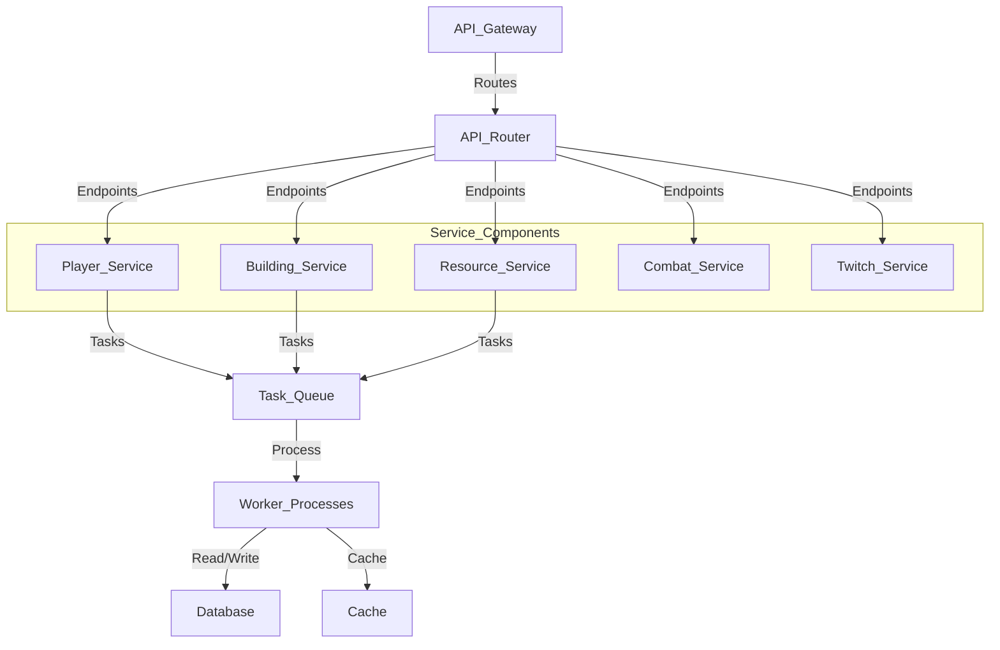

# Detailed Component

```mermaid
graph TD;
    API_Gateway -->|Routes| API_Router;
    API_Router -->|Endpoints| Player_Service;
    API_Router -->|Endpoints| Building_Service;
    API_Router -->|Endpoints| Resource_Service;
    API_Router -->|Endpoints| Combat_Service;
    API_Router -->|Endpoints| Twitch_Service;
    
    subgraph Service_Components
        Player_Service
        Building_Service
        Resource_Service
        Combat_Service
        Twitch_Service
    end
    
    Player_Service -->|Tasks| Task_Queue;
    Building_Service -->|Tasks| Task_Queue;
    Resource_Service -->|Tasks| Task_Queue;
    Task_Queue -->|Process| Worker_Processes;
    Worker_Processes -->|Read/Write| Database;
    Worker_Processes -->|Cache| Cache;
```