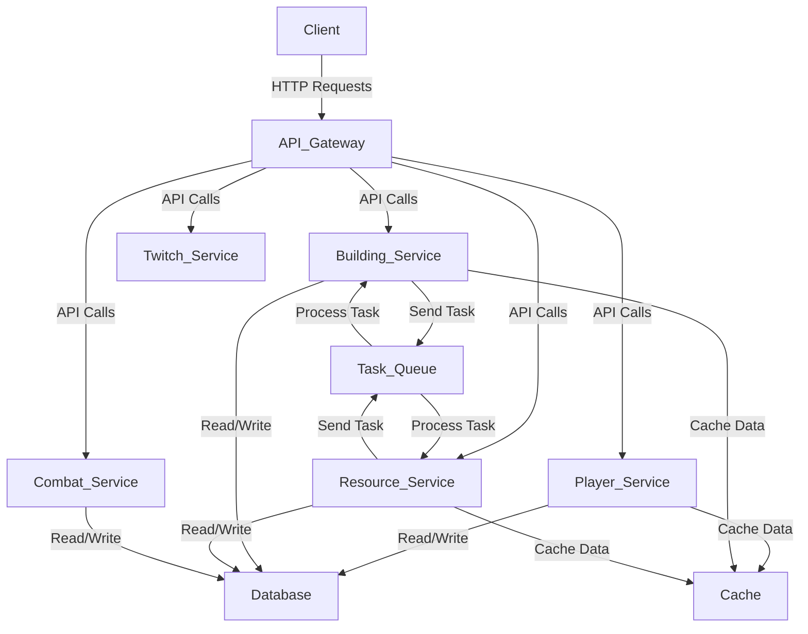

# High level Diagram

```mermaid
graph TD;
    Client -->|HTTP Requests| API_Gateway;
    API_Gateway -->|API Calls| Player_Service;
    API_Gateway -->|API Calls| Building_Service;
    API_Gateway -->|API Calls| Resource_Service;
    API_Gateway -->|API Calls| Combat_Service;
    API_Gateway -->|API Calls| Twitch_Service;
    Building_Service -->|Send Task| Task_Queue;
    Resource_Service -->|Send Task| Task_Queue;
    Task_Queue -->|Process Task| Building_Service;
    Task_Queue -->|Process Task| Resource_Service;
    Player_Service -->|Read/Write| Database;
    Building_Service -->|Read/Write| Database;
    Resource_Service -->|Read/Write| Database;
    Combat_Service -->|Read/Write| Database;
    Player_Service -->|Cache Data| Cache;
    Building_Service -->|Cache Data| Cache;
    Resource_Service -->|Cache Data| Cache;
```