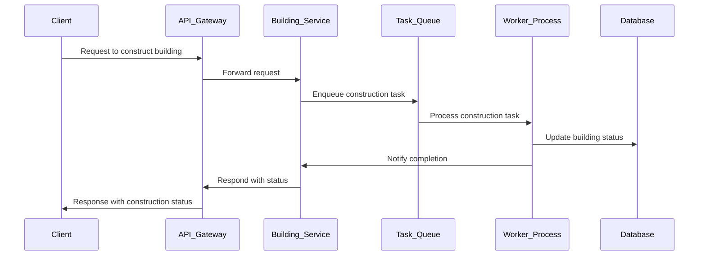

# Sequence

```mermaid
sequenceDiagram
    participant Client
    participant API_Gateway
    participant Building_Service
    participant Task_Queue
    participant Worker_Process
    participant Database

    Client->>API_Gateway: Request to construct building
    API_Gateway->>Building_Service: Forward request
    Building_Service->>Task_Queue: Enqueue construction task
    Task_Queue->>Worker_Process: Process construction task
    Worker_Process->>Database: Update building status
    Worker_Process->>Building_Service: Notify completion
    Building_Service->>API_Gateway: Respond with status
    API_Gateway->>Client: Response with construction status
```